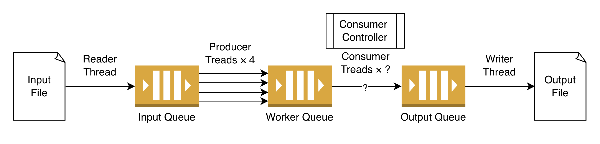

# Pthreads Programming Assignment: Producer-Consumer Problem

## I. Goal

- Understand how to work in the Linux environment.
- Understand how multi-thread programming can be done with the pthread library.

## II. Description

The producer-consumer problem is a classic programming exercise in computer science. In this project, you will be given some Items, each Item contains an opcode, a key and a value. The producer and consumer are responsible to perform a transform function on the Item's value respectively. Different transform functions are performed based on the Item's opcode.



The program starts with 1 Reader thread, 4 Producer threads, 0 Consumer thread and 1 Writer thread. The buffered size of the Input Queue, Worker Queue and Output Queue is predefined in the main.cpp file:

```cpp
#define READER_QUEUE_SIZE 200
#define WORKER_QUEUE_SIZE 200
#define WRITER_QUEUE_SIZE 4000
#define CONSUMER_CONTROLLER_LOW_THRESHOLD_PERCENTAGE 20
#define CONSUMER_CONTROLLER_HIGH_THRESHOLD_PERCENTAGE 80
#define CONSUMER_CONTROLLER_CHECK_PERIOD 1000000
```

The program also starts with 1 ConsumerController thread, which controls the number of consumers. When the number of items in the Worker Queue exceeds the 80% of the Worker Queue size, the number of consumer threads should be scaled up by 1. On the other hand, when the number of items in the Worker Queue falls behind 20% of the Worker Queue size, the number of consumer threads should be scaled down by 1.

The reader thread should end after reading all Items from the input file; the writer thread should end after writing all Items from the output file. The main program should wait for reader thread and writer thread to complete then terminate.

## III. Assignment

### a. Code Structure

- **TSQueue** (`ts_queue.hpp`): A thread safe queue that allows multi-thread access.
  - `enqueue`: Add an element into the queue.
  - `dequeue`: Remove the first element from the queue and return the element.
  - `get_size`: Returns the number of elements in the queue.

- **Reader** (`reader.hpp`): Reader runs in a thread that reads Items from the input file then puts Items into the Input Queue.

- **Transformer** (`transformer.hpp`): Defines the producer and consumer transformation functions.

- **Producer** (`producer.hpp`): Every Producer runs in a thread that takes Item from the Input Queue, applies the Item with the Transformer::producer_transform function, then puts the result Item into the Worker Queue.

- **Consumer** (`consumer.hpp`): Every Consumer runs in a thread that takes Item from the Worker Queue, applies the Item Transformer::consumer_transform function, then puts the result Item into Output Queue.

- **ConsumerController** (`consumer_controller.hpp`): ConsumerController runs in a thread that controls the number of consumer threads dynamically.

- **Writer** (`writer.hpp`): Writer runs in a thread that reads Item from the Output Queue then writes Items into the output file.

### b. Implementation

**TSQueue**: Implement a thread safe queue to support enqueue, dequeue, getsize operations.

- **Note: You should use the pthread conditional variable to avoid busy waiting on the queue full when enqueuing, or the queue empty when dequeuing.**

**Producer**: Create 4 Producer threads when the program starts. When each Producer thread starts, it repeats to:
- Take an Item from Input Queue.
- Use Transformer::producer_transform to perform transform on the Item's value.
- Put the Item with new value into the Worker Queue.
- Do not modify the Item's key and the Item's opcode.

**Consumer**: When the Consumer thread starts, it repeats to:

- Take an Item from the Worker Queue.
- Use Transformer::consumer_transform to perform transform on the Item's value.
- Put the Item with new value into the Output Queue.
- Do not modify the Item's key and the Item's opcode.

**ConsumerController**: Create a ConsumerController thread when the program starts. When the ConsumerController thread starts, it repeats to:
- In the beginning, no Consumer thread is created by ConsumerController.
- Check Worker Queue status periodically. (The period is defined in main.cpp as CONSUMER_CONTROLLER_CHECK_PERIOD **in microsecond**).
- When the Worker Queue size exceeds high_threshold, create a new Consumer thread.
- When the Worker Queue size falls behind low_threshold, cancel the newest Consumer (by calling Consumer->cancel).
- **Once you have created a Consumer, make sure there is at least one Consumer until the program ends.**
- Maintains the list of running Consumers in ConsumerController::consumers.

**Writer**: Create a Writer thread when the program starts. When the Writer thread starts, it repeats to:

- Take an Item from the Output Queue.
- Write the Item to output file with the same format as the input file (`{key} {value} {opcode}`).

**main.cpp**: Implement your main function, the main function ends after reader thread and writer thread complete.

### c. Notes & Hints

- Search for all `TODO:`, that's all you need to do.
- All `*_test.cpp` files are only for unit testing, e.g. `ts_queue_test.cpp`. You can decide whether to use them for verifying or not. We will not use them to verify your code.
- You should output a message to **stdout** when scaling up and scaling down that shows the number of consumers before and after scaling. For example: "Scaling up consumers from 1 to 2" or "Scaling down consumers from 5 to 4".
- You can implement your own transformer.cpp and input file. We will replace the transformer.cpp file when verifying your code.

### d. Compile, Run and Test

Refer to [README.md](./README.md) for detailed instructions on setting up Docker.

**Steps:**

1. Generate transformer.cpp file:
   ```bash
   python3 scripts/auto_gen_transformer.py --input tests/00_spec.json --output transformer.cpp
   ```

2. Clean and build:
   ```bash
   make clean
   make docker-build
   ```

3. Run your main program:
   ```bash
   ./main 200 tests/00.in tests/00.out
   ```

4. Verify your answer:
   ```bash
   python3 scripts/verify.py --output tests/00.out --answer tests/00.ans
   ```

We already provide 2 test cases. You can change and test other test cases by changing all `00` in the commands to `01` and `200` to `4000`. You can also add your own test cases.

## IV. Grading

### a. Implementation Correctness - 50%

- Public testcases (20%): you can execute `./grade-pthread-public` to test your code.

- Must use **Pthread library** to implement multi-thread programming.

- **No Plagiarism**. If you copied someone's code and cannot explain your implementation, you will get 0 points.

- **Late submissions will not be accepted**. Refer to the course syllabus for detailed homework rules and policies.

- Your code should be placed in repository `os<year>_team<team-id>_pthreads`, else you will get 0 points on this part.

- **Remember to remove your additional debug message**.

- **Remember to adjust all defined parameters back to the original value**.

  ```cpp
  #define READER_QUEUE_SIZE 200
  #define WORKER_QUEUE_SIZE 200
  #define WRITER_QUEUE_SIZE 4000
  #define CONSUMER_CONTROLLER_LOW_THRESHOLD_PERCENTAGE 20
  #define CONSUMER_CONTROLLER_HIGH_THRESHOLD_PERCENTAGE 80
  #define CONSUMER_CONTROLLER_CHECK_PERIOD 1000000
  ```


### b. Experiment - 20%

Conduct the following experiments and write down your experiment results in your report.

- Different values of `CONSUMER_CONTROLLER_CHECK_PERIOD`.
- Different values of `CONSUMER_CONTROLLER_LOW_THRESHOLD_PERCENTAGE` and `CONSUMER_CONTROLLER_HIGH_THRESHOLD_PERCENTAGE`.
- Different values of `WORKER_QUEUE_SIZE`.
- What happens if `WRITER_QUEUE_SIZE` is very small?
- What happens if `READER_QUEUE_SIZE` is very small?

### c. Report - 15%

- The report must detail team member contributions and offer a clear explanation of your implementation.
- Explain what additional experiments you have done and what are the results. **You are encouraged to do more experiments**.
- What difficulties did you encounter when implementing this assignment?
- Any feedback you would like to let us know.
- Name your report `pthreads-report.md` and upload it to repo.

### d. Demo - 15%

You will have a 15-minute session to answer TA questions regarding your implementation and specific details of the **experiments**.
